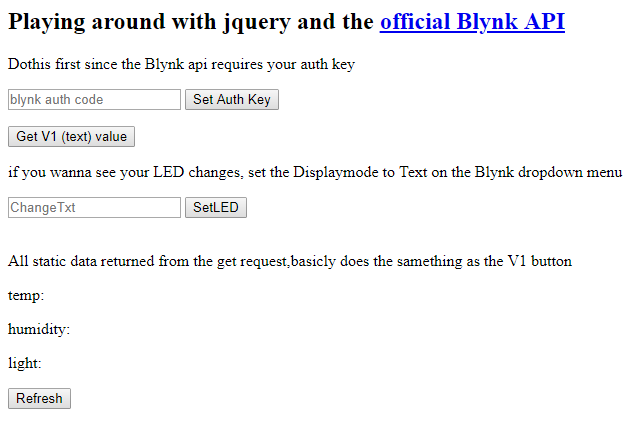
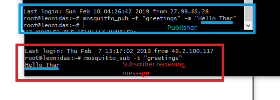

# First Sprint

## What I did

### Day 1 - Monday

After the welcoming event, the group were instructed to put together a Data Logger, which I found very interesting as that is my first exposure to electronics (soldering is pretty fun). 
[Documentations](http://iot.nortcele.win/doc/) (board schematics and source) are also provided by Danon, the Studio's Tutor. 
In the docs, there are also guides for how to interact with the Data Logger.

### Day 2 - Tuesday

The second day was rather tough for me.
I didn't plan what to do for the day.
Therefore, I find my self researching multiple different topics at the same time, not knowing where to start first.

Danon informed us with the [Blynk API](https://blynkapi.docs.apiary.io/), which could simply use used some jquery and built a simple app to interface with the Blynk app.

It worked as expected *locally*, as this is hosted using [Github Pages](https://pages.github.com/) there was some trouble to get it working on Github Pages due to a **protocol problem**. GitHub pages requires all attached links to use https whereas the Blynk API only works with http. I did not manage to get it working but this is what it looks like and [here is the code]().



### Day 3 - Wednesday

I spent *"some time"* on the third day getting to know the people I'll spent my next 4 weeks with. 
The majority of my cohorts are *Electrical Engineering majors* whom I could **learn a lot** from and maybe and brainstorm some problems to solve for this studio.
Before coming up with a problem I want to solve, some other problems I came up are:

> I find my self sitting for long period of times at home.
> Thus I could set a device that starts a timer when Im sitting and "notifies" (in a form of an *electrical shock*) when the timer reaches a threshold.

> Even with weather forecast, it is difficult to estimate the weather conditions of your daily destination(workspace, school) to better prepare your day.
> My solution involves sensors at their workplace/school which allows them to make more informed decisions.

I also spent a part of the day trying to reverse engineer the [source code](http://iot.nortcele.win/doc/Downloads.html) for the **Data Logger**.
Focusing on the `WifiMgmt.cpp` to try and figure out how data is transmitted to the cloud from the `esp8266` wifi chip.
I could see what is used for what function but have yet figure it out, they could be located in the missing `DataSync` files.

### Day 4 - Thursday 

I get to experiment with a few "new" techs.

**Cloud computing** with [Vultr](https://www.vultr.com/) (my **first time**), which lets me deploy a virtual server.
And `mqtt`, a communication protocol which enables fast and lightweight `machine-2-machine` communications.
With `mqtt`, different machines(clients) would talk to each other through a **Publisher/Subscriber** messaging patern, facilitated by the "broker server"(which is the virtual server on **Vultr** I had set up).

Deploying the [Mosquito mqtt](https://mosquitto.org/) on the virtual server was a lot more simpler than I thought. You can see It functioning as below.



<!-- Also, Danon confirmed 1 -->

### Day 5 - Friday

The last day of the first sprint, I spent building my portfolio and documenting my progress so far.
This is the structure I decided to set my portfolio in.

```md
Portfolio layout
|-- Personal Intro/ Skills
|-- Summer Studio
|       |--Problem/ Solution
|       |--Learning Contract
|       |--Sprint 1
|       |-- ...
|       |--Sprint 4
|-- Other Projects
|-- Interests..
```

Another peer shown me VuePress, a `SPA framework` that generates very nice and presentable html page for documentation from markdown (Which I use to take notes).
The only issue is when ever I make a change to the site.
I need to regenerate the **static `html` files** and push it manually on the Git repo.

There are a lot of guides that shows you how to apply `CI`(Continuous Integration) feature by just simply update the `md` files, but I have yet to figure out the correct configurations at the moment.

---

## Evaluation


I dove into this Studio expecting a more structured and guided teaching course, but the purpose of the studio is to build the ability of working independently without much supervision.

Therefore, I was struggling a bit in this Sprint. 
I need to **change my mindset** in approaching the Studio and in learning. What I need to do first from now is figure how I will build this solution and **break it down** to smaller task.

I'm glad that I'm able to attend this studio and **did not give up**. Even if I failed this studio, I would have learned how to be better.

## Improvements

- try to **be more proactive** during the Studio, as I always have been exposed to something new every time I did speak up (Virtual Pi server with Vulture, `mqtt`, Vuepress. ). I thought that I didn't have much to offer as a first year student, but I think I could offer some insight in the backend, programming side of the project.
- **Document** my progress more often, both achievements and failures for review to change up my approach to learning.
- Focus on **one problem at a time**. I find myself bouncing to different problems whenever I hit a wall, and wasting time researching various different topics, resulting in no feasible solutions.
- **KISS** - **K**eep **i**t **s**imple, **s**tupid. A design philosophy states that most systems works best if kept simple.