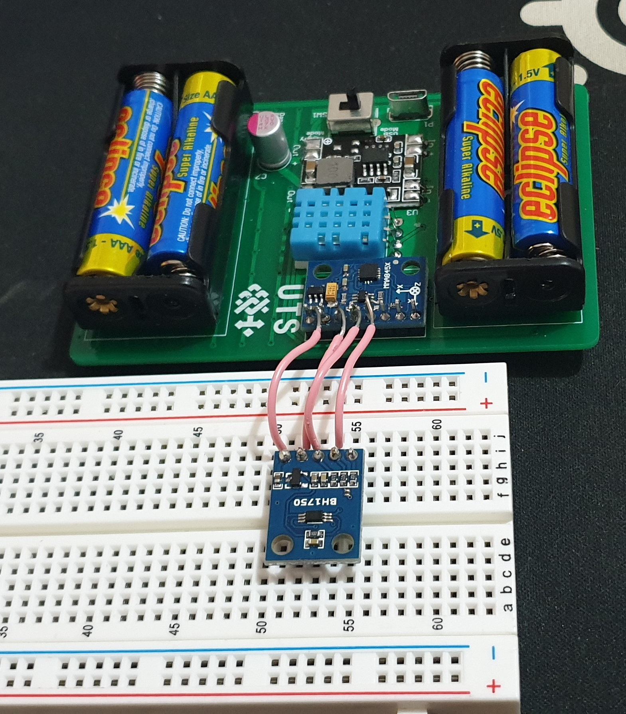
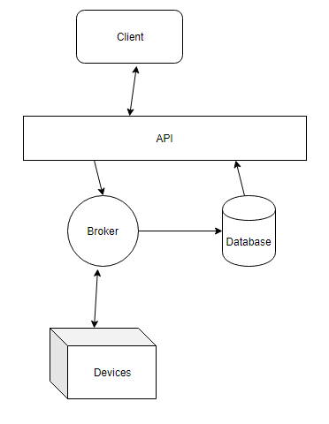
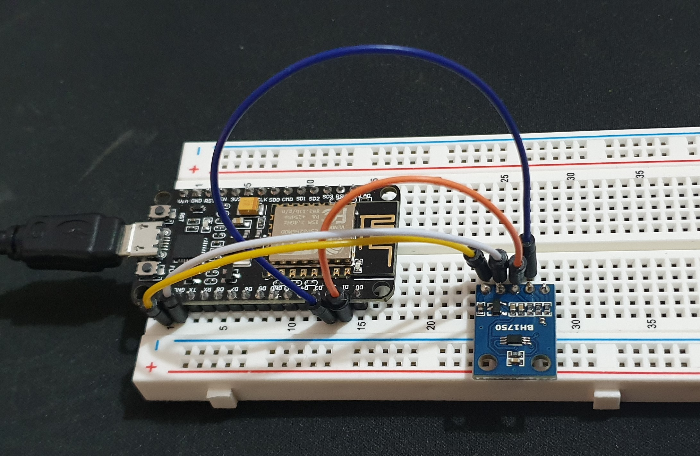
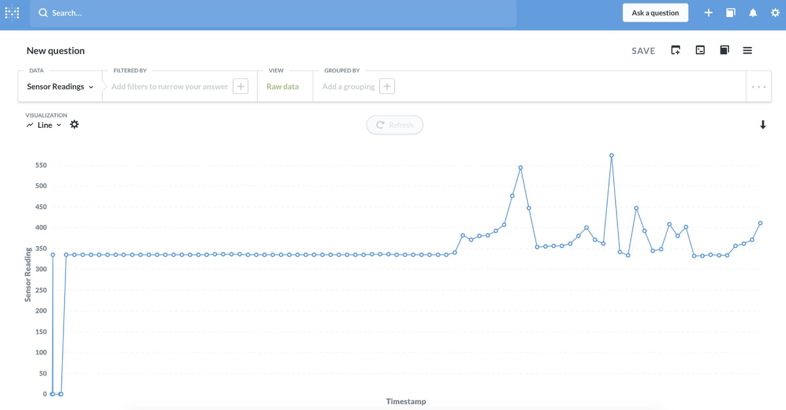
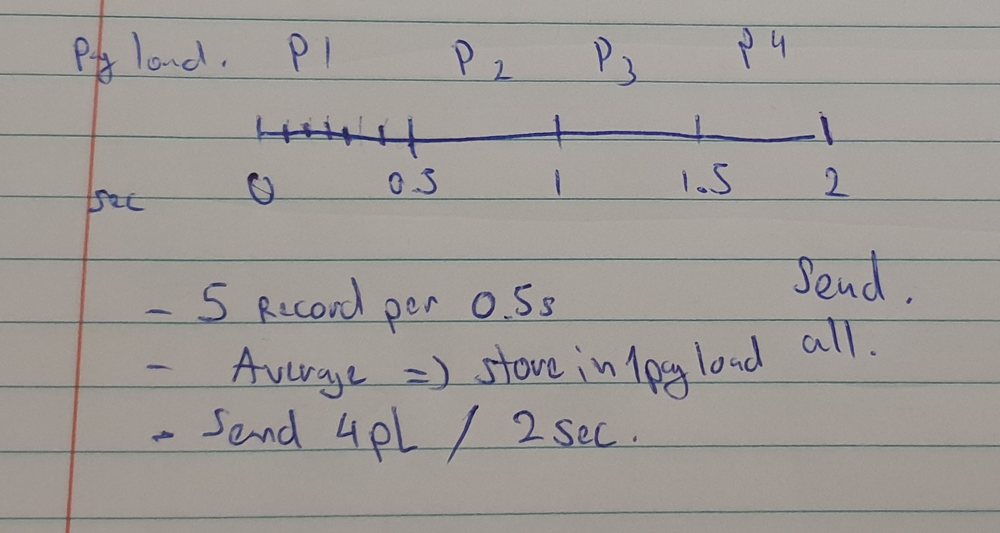
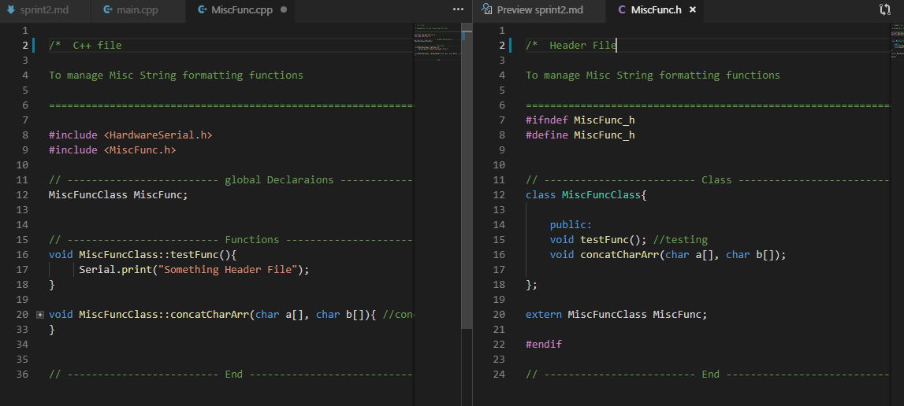

# Second sprint

## Week plan

To improve from last week, I approached this week with more **thought and planning** into my tasks this week.
Spending some time at the end of each days to plan some task for the next day, 
and at the start of each day, break down those tasks to smaller, and more detailed objectives to be completed through out the day.

### Day 1 - Catch-up

#### Proof of Concept (using the `bh170` light sensor)

Part of the day is spent trying to build a simple **Proof Of Concept** that would gather data and send it through the `mqtt` broker, using a more accurate "[ambient light intensity sensor `bh1750`](https://www.mysensors.org/build/light-bh1750)".
The construction and programming was rather simple with this sensor. 
When connected with the DataLogger like the image below, the [example code](https://github.com/claws/BH1750/blob/master/examples/BH1750test/BH1750test.ino) from the [`bh1750` library](https://platformio.org/lib/show/439/BH1750) worked immediately with out configuration.



#### Overall IoT Framework

I also **collaborated** with my team and work on the general architecture for our IoT System.
Even though each members are working on different problems, working together to build a **common architecture** allow us to have more time to improve our own projects.
We agreed on this model.



According from this model, from the top down.
The client will be able to control the devices using an `API`.
All and any recorded data is received through the `MQTT broker` and stored in a database.
Which then could be presented to the clients for analysis with the `API`.

Seeing the agreed on model is very similar to [my own idea](../summer/#solution) for the architecture. I glad to see that I was on the right track.

#### Data Visualizer

Having database already setup by teammate, I set up a data base visualizer called [Metabase](https://www.metabase.com/), recommended by Danon, on another server.
All it needs to do is to attach a db to work.

### Day 2 - Database

#### Relational v Non-Relational

Having past experience with *relational* databases(`mysql`, `sqlite`), I want to better understand the **Non-Relational database**, `MongoDb` my team is using to store sensor data.

| Relational | Non-Relational|
|---|---|
|Fixed format: requires to define a **schema**, better data integrity | More **flexible structure**, better for data that changed frequently |
| Data relation: better at **linking** related data | In MongoDb, data is recorded as **separated**, unrelated documents|

> **Sources**
> - [`MongoDB` documentation](https://docs.mongodb.com/manual/)
> - [Intro to NoSql](https://youtu.be/uD3p_rZPBUQ)
> - [SQL v NoSQL or MySQL v MongoDB](https://youtu.be/ZS_kXvOeQ5Y)

#### MongoDb

Also as a part of my learning contract to learn new and different tools, I planned the day to focus on learning `MongoDb`.
I went through some videos, made some notes on the [syntaxes]()(`mongodb` queries are much simpler than `SQL` queries). Then deployed, my own MongoDb on another `Vultr` Server using this [guide](https://www.digitalocean.com/community/tutorials/how-to-install-mongodb-on-ubuntu-18-04).

The only thing left to do is to **build** a `Node` Application which insert published data from the MQTT into the database.

**NOTE**: This part of the architecture was already implemented by another member of my group on the "turtle" server. The decision to learn `MongoDb` is out of my own interest and to fulfill my [learning contract](../summer/#learning-contract) for this Studio.

### Day 3 - Proof of concept

#### Messaging Protocol

Due to the limitation of the [`PubSubClient`](https://github.com/knolleary/pubsubclient)'s payload publication(`128 bytes` per payload).
My Team has to change the initial plan of sending data in the format of a `JSON` object into a `string` to better fit that restriction.
My team had agreed upon a sending a payload in the format of a string consist of **12 characters**(generally alphanumerical chars are **1 byte** each).
The server will then set up to splice up the string into separate categories and stored as a document in the DB.

```md
Example Payload: `ab0000cdxxx`

- `a`    = deviceID         [a-zA-Z0-9]
- `b`    = topic            [a-zA-Z]
- `0000` = timestamp        4[0-9]
- `c`    = sensorID         [a-zA-Z0-9]
- `d`    = senorType        [a-zA-Z]
- `xxx`  = sensor reading   3[0-9.]
```

#### Prototype

I received and used a [NodeMCU](https://www.nodemcu.com/index_en.html) to build a simpler and more compact device(as seen below) comparatively to the device in [day 1](#day-1-catch-up) of this sprint.



#### Using Metabase

With my device publishing data into the *"turtle"* db using the new protocol. My team linked the database to **Metabase** I set up on Monday and produced this graph with some sample generated data from the `bh1750` sensor.



### Day 4 - Improving the PoC

With Most of the **basic functionalities** done, I spent the day thinking about how I could further **improve** my solution's Proof of Concept

#### Large scale Design

Thinking about if my device would have been implemented in a **large city** using [this doc](https://www.essentialenergy.com.au/our-network/streetlights) as a reference, these are issues which needs to be address.

- A difficult issue would by how data is transmitted. The current design is built with assumption that a `wifi` connection is **available everywhere**.
- Power is another realistic issue. There are 2 ways of approaching this:
  - One is to modify current light poles to house the device and use the pole's power, but that would be rather **expensive to replace** the current infrastructure.
  - Another method is to build the device as an attachment to a light pole, powered by **its own power supply**.
- With how the device functions, notifies the responsible organizations for street lights when they are non-functional and keep data on the bulb's life span. It is not necessary to continuously record the data. This should further help **increase the lifespan** if the device is built with its own power supply

#### IoT DataLogger comparison

I also used the **IoT Datalogger** as a model to further improve my PoC. Especially how it averages data from the **accelerometer** to be more accurate for situations where there would be a **rapid change/spike** in the data.

The data logger would collect a number amount of entries over 3 seconds, averaging it into **10 separate payload**, then send all of them at the end of the 3 seconds.

I would like to also implement this feature with different numbers. How it works can be seen below



### Day 5 - c++

I spent Friday to have a closer look at the code of the device.
Specifically how **header files** of `C++` works to better **refactor** the code.
This is also be my first time working with **C++**, so seeing that you need to declare functions/methods in 2 separate files `FileName.h` and `FileName.cpp` is kind of strange.
I guess it is similar to **inheritance**?

Going through video such as [this](https://youtu.be/9RJTQmK0YPI), and started with a simple command to print something on the Serial console



From there, I moved on to try to implement the data averaging function similar to the DataLogger (albeit my code is pretty `hacky` ehehe)

```cpp
void LightSensorClass::BHPayloadReadings(char* a){ 
    //float readings[5]; // .5 sec
    float PLTotal = 0;
    float PLAverage;
    
    for(int i = 0; i < 6; i++){
        PLTotal += BHReadings();
        // nice one 
        // theres better ways to do this
        Serial.print(BHReadings());
        Serial.print(" added in = ");
        Serial.println(PLTotal);
        delay(100); // .1 sec
    }
```

But then there is **a bug** during the runtime of the device, the recorded data per payload would be **all identical**.
From a small consultation with a peer, It has something to do with this code block in the `loop()` as seen below. I don't exactly understand how it works yet. I guess, brute force does not work.

```cpp
long now = millis();
if (now - lastMsg > 1000) {
    lastMsg = now;
    value++;
}
```

## Evaluation

I can say with a little planning, this sprint was less overwhelming and stressful than the previous sprint.
I also think, I successfully achieved more and learned more when a target goal is set.

Moving on from this, I need to better **prioritize** what I need to do to complete the solution.
At the moment, the bare bone and basic functionalities of the IoT framework is done.
All that left to do is to build an interface to complete the framework. Beside from that, I need to better refine the device quite a bit to better solve my problem.

### Plan for next sprint

- Building an **interface**, with the goal for the user to see the status of each street light, and see the performance trend of that street light.
- Add a **power supply** for the device, configure it to be active in a certain time, and only collect data once every x time to further extend the battery life

