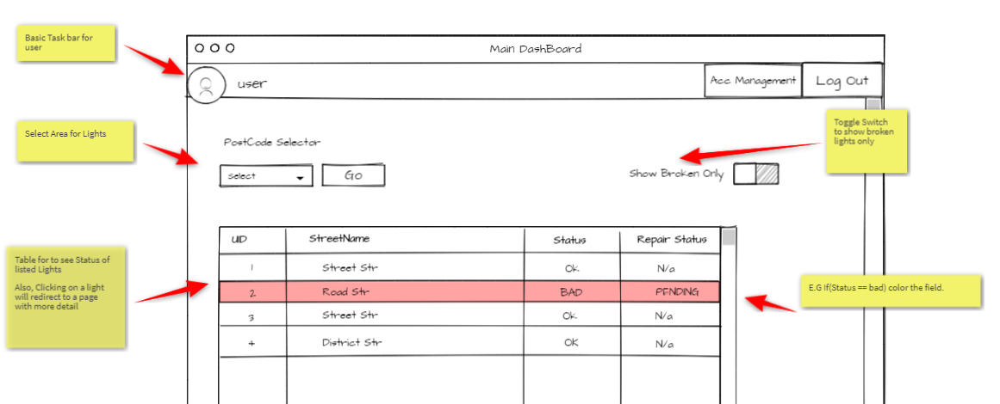
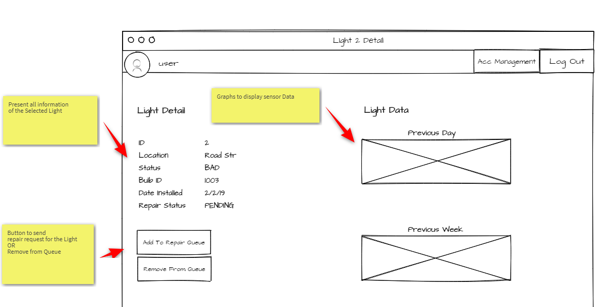
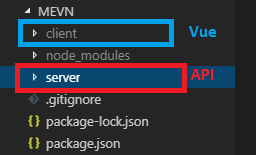
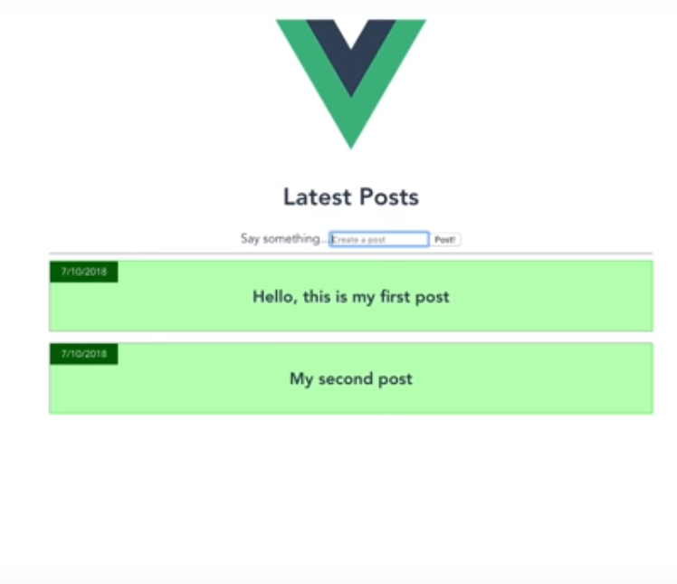
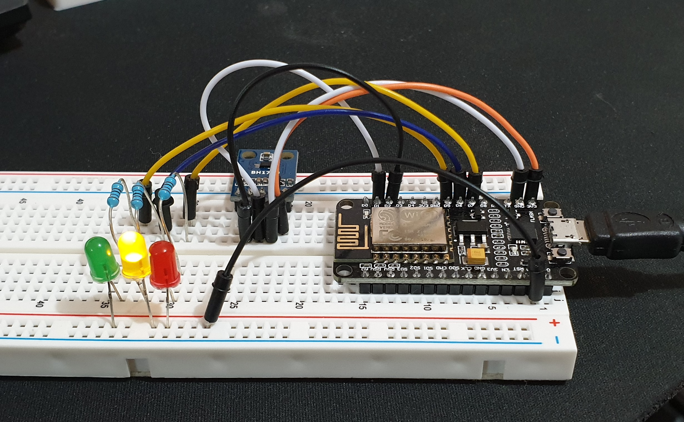

# Third sprint

## Plan

As mentioned in the previous sprint, this sprint's goal is to focus on building an **interface** and add a **power supply module** my device. Based Danon's advice to keep things at a high level and what I already have, a **functional** device that records data which is transmitted through a `mqtt broker` and stores it in a database. 

### Building an Interface

- Design the layout of the Interface
- Build `API` to get data from the db
- Build a basic front end
- Display information from the `API`

### Adding a Power Supply

- Figure how to wire in batteries
- Figure how `Voltage/Amperage` works
- Add Low Power Function
- Calculate how long the device would last on batteries

## What I did

### Interface Design

I begun this task with noting down what the user would use the app for.
The App would be where the client would use to monitor the information of active devices.
Each devices would be attached to one light pole, I would need 1 page to present **basic information of active devices**.
I would also need to be able to observe the status of each individual lights, so 1 more page to display more data of a specific light.

With those parameters, I then went do did a rough sketch on paper for what the pages will look like. Then use the service [MockFlow](https://mockflow.com/) to do a wire frame of the app.

#### Main Page

This page is used to display all the sensors in a table format.



Clicking any row will direct the user into the Details page of the clicked device.

#### Details Page

This page is used to show more information of a specific device



### NodeJs

Although I've had a little experience in building **webapp** in the [ASP.NET core framework](https://docs.microsoft.com/en-us/aspnet/core/?view=aspnetcore-2.2).
Im opting to learn to build the interface in NodeJS as mentioned in my Learning contract. Also beside from simple front end scripts, this would be my first exposure in using `JavaScript`

#### How I Learnt it

The first source I used is to learn node is from the **Node Beginner** book by *Manuel Kiessling*.
It does a great job describing how the **asynchronous functions** works in `NodeJs`.
Through out, it shows you how to serve a basic static website and manages routing requests.
Overall, it was very helpful in explaining the operations of NodeJS and I will definitely save it for **future revisions**.

[Here is my notes on the Book]().

Another source I used is [Guru99 NodeJsTutorial](https://www.guru99.com/node-js-tutorial.html).
This also shows me a little bit of [ExpressJS](https://expressjs.com/), which is a different framework focuses more on building webapp.
I think I will use this framework instead to build my interface as it seems relatively simpler than using `vanilla NodeJS`.

Comparing `ExpressJs` and `NodeJS`, the code presented below does the same thing at hosting a site locally.
The biggest **difference** between the 2 framework is in the `ExpressJs` side, `app.get()` function does both routing and telling the server its a `GET` request.
Where as to do the same in `Node`, you need to implicitly set up the routing yourself.


### MongoDB

I had some time learning and experimenting with MongoDb in the [previous sprint](../summer/sprint2.html#mongodb), It has been very helpful in querying data. But to  it with node its a whole different picture.

The [Guru99 NodeJsTutorial](https://www.guru99.com/node-js-tutorial.html) also had some information regarding using `node` to connect with `MongoDb`.
But It bought up a big issue when learning programming, **deprecated code**, its when old functions or elements of a framework are no longer compatible with more updated ones.
As a student I wasn't sure if what I typed is **wrong** or not.
In retrospect, I should have realized that the guide is very old when forum post [like these](https://stackoverflow.com/questions/47662220/db-collection-is-not-a-function-when-using-mongoclient-v3-0/47662979) tells you to use an older version of the Node Package **mongodb**.

With a recommendation of a team member, *Sebastian*, to try and follow the [official documentation](https://mongodb.github.io/node-mongodb-native/3.1/quick-start/quick-start/).
*Surprise*, *surprise*, it works.
All I need to do is to instantiate a `MongoClient` object first, rather than just use its `connect()` function after declaring `require('mongodb')` on top.

```js
const client = new MongoClient(url);            // do dis
// MongoClient.connect(url, (err, db) => {})    // no gud

client.connect(() => {
    console.log("connected");
    const db = client.db('turtle');             // set db

    // find docs with field a = 1
    var promise = db.collections('sensorreadigs').find({a:1});  
})
```

After this, I went through the whole [Quick-start part of the Official Docs](https://mongodb.github.io/node-mongodb-native/3.1/quick-start/quick-start/) and completed the basic **CRUD**(**C**reate **R**ead **U**pdate **D**elete) functions for the `mongoDB`.

You can see all my work on **Node-MongoDb** here:

- [dbQuickStart]()
- [moreNode]()
- [node-example]()

:::warning
If you want to try to execute them, you might need to edit in your **db connection** url and/or run `npm install` as I had put the url string and `node_package` folder into `.gitignore` for storage and security reasons.

```js
const url = require('../../cred.js')
```
:::

### VueJS

[VueJs](https://vuejs.org/) is another JS framework libary for building UI. There are also other more popular frameworks such as [AngularJs](https://angular.io/) and [ReactJs](https://reactjs.org/), but after a deep deep dive(bleh) into the rabbit hole of **Angular v React v Vue**. I decided just to keep it simple and stick with **Vue** as its seems to be the simplest framework out the the 3 for beginners and I've already been using [**VuePress**](https://vuepress.vuejs.org/guide/#how-it-works) to write these blogs.

So using [this guide](https://www.youtube.com/watch?v=j55fHUJqtyw), I built my first **MEVN** (**M**ongoDb, **E**xpress, **V**ue, **N**ode) full-stack app.

The app consist of 2 separate parts, the **API** to get data from the db as `json`, and Vue to process the information form the API and present it to the user.



#### API

The API would consist of simple **CRUD** (without the update) functions to interact with the db. It can *GET* data, *CREATE* new docs, and *DELETE* docs by `id`.

```js
// GET
router.get('/', async (req, resp) => {
    const post = await LoadPostCollection();
    resp.send(await post.find({text:{$exists: true}}.toArray()));   // OK
})

// ADD
router.post('/', async(req,resp)=>{
    const post = await LoadPostCollection();
    await post.insertOne({      // insert 1 doc
        text: req.body.text,    // { text: text,
        createdAt: new Date()   //   createdAt: date }
    });
})

// DELETE
router.delete('/:id', async (req,res)=>{
    const post = await LoadPostCollection();
    await post.deleteOne({_id: new mongodb.ObjectID(req.params.id)});
    console.log("deleting something");
})

```

#### Vue Framework

The client folder for Vue consist of 2 smaller parts, `Service` to interact with the API and the `Component` which contains the html layout and js scripts to call functions from the `Component` and interact with the Db. Here is the GitRepo for the whole `MEVN` app for my work.

The App would look like this:



After finishing the guide, for **practice**,I proceeded to build a different app from scratch, "borrowing" the db connection string from the other teams. And deployed it to a **vultr server**.


### Electronics

This Sprint I did not end up improving much my device at all as I was preoccupied in learning how to build the Interface using "brand-new" frameworks to me.
The final presentation is coming up in a week, so I want to first complete the whole POC first.
But to prepare for the presentation, I added on 3 **different colored LED** which lit up if the sensor data hit a **threshold**.
This should provide a visual representation of the collected data.




## Evaluation

Overall, I am not satisfied with the amount of work that was done this week. I did not achieve the majority of the **goals** I set out for myself this week.
I did not successfully built an **interface**, but ive only learnt how to.
I spent too much time being stuck on silly bugs, and comparing what framework to use.
I definitely could have figured out how to attached a **power source** to the device this sprint.

### Change of Blog Format

This change is because I want to better categories the technologies and topics I achieved throughout the week.
Day2day journals are great too for tracking overall performance but I would like to better **document** the technologies I learnt for future references.

### Plan for Final Sprint

With Only 4 days left to work on my project, I need to be more realistic in the task I could do. In the next 4 days I will:

- **Complete Basic Interface:**
  - Add a collection for Device Detail (link to sensor readings by `ID`)
  - Build Main page presenting DeviceDetail
  - Build Device Info Page
  - Build line graph to present data
    - figure out how to better query the db for faster load time (grabbing 2000+ readings for a graph is bad)
- **Attach Power Source**:
  - Ask for help on this, you don't know electronics.


If there is still **free time** after completing these tasks, I will attempt to:

- Implement Low Power mode
- Figure out how to send commands back to the device
  - this is good for low power mode, I can send a signal to turn the device on at certain time to further save power?
