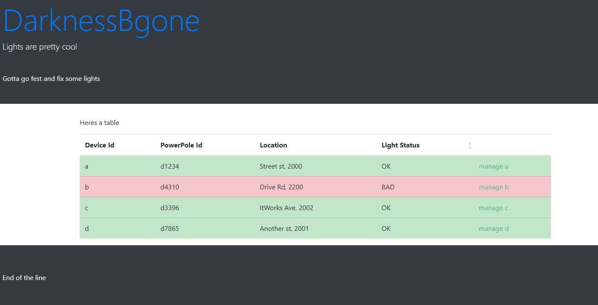
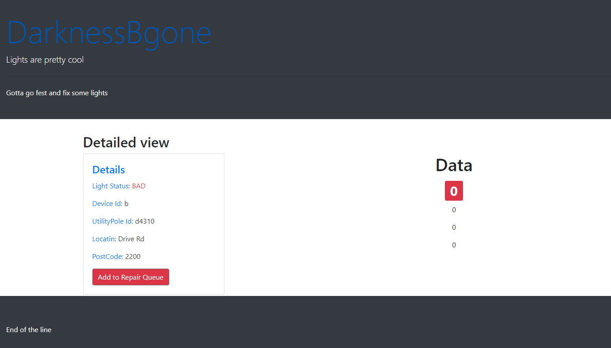
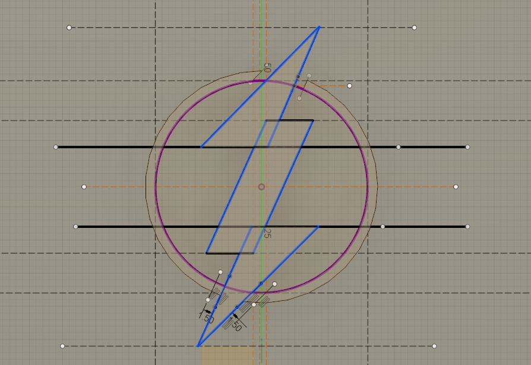
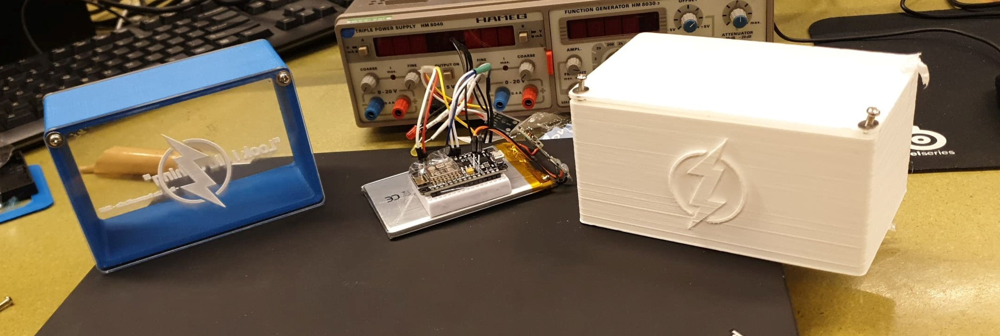
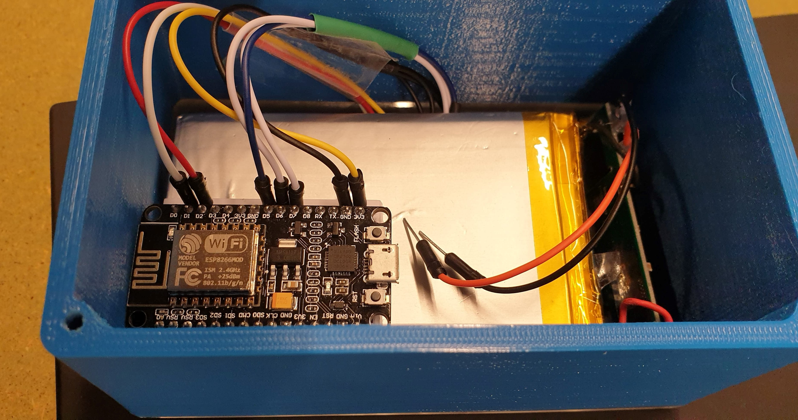
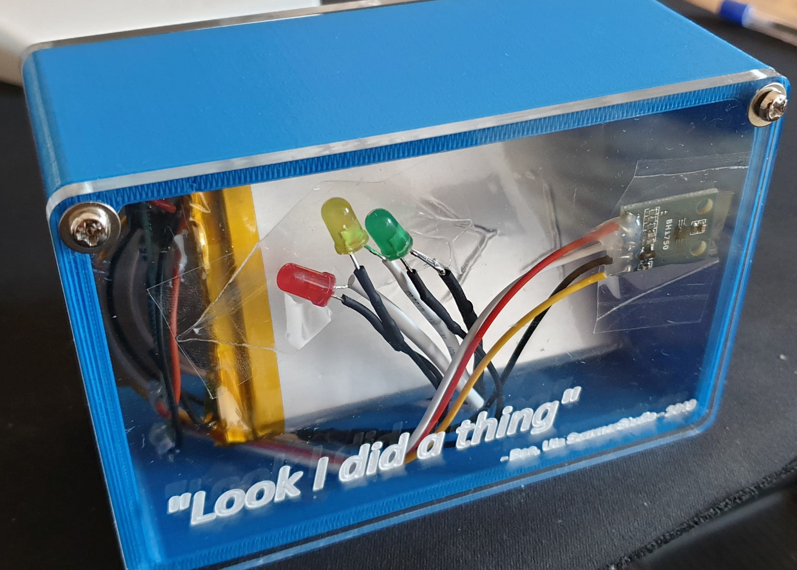

# Final Sprint

## Finishing up

### Building the WebApp

To finish up everything, all I need is to build a **WebApp/ UI** to interact with the data.
To better fit my wire frame design in the [previous week](./sprint3.html), I added another collection called **bDeviceDetails** into the database.
This collection is to store the **individual details** of my devices if there are multiple active devices in the system.
Since I only have 1 active device at the time, I added some sample data to test while building the site.


I begun with building the **backend** processes of the webapp, the `API` which will be used to take data from the database to be presented on the webapp. Overall, my `API` have the ability to:

- return the details of all devices
- show the details of a single device (searched by using the `UniqueId` of the device)
- show the data of a single device (searched by using the `UniqueId` of the device)
- the ability to toggle the status of a single device( `OK` to `BAD`, and vice versa)
- Heres an example of device details returned by the API of all devices.


Also if you have a closer look at the url link above, this code under here is used to route the call to `leonidas.summerstudio.xyz:5000/api/details` to trigger the second half of the code block below to go and grab all documents from the `bDeviceDetails` collection. **PLUS**, if you would go and compare the number of docs from the `API` to the sample data img above, the information you see between them should be the very similar.

```js
// routing api // from index.js
const deviceDetails = require('./api/deviceDetails.js')
expressApp.use('/api/details',deviceDetails);

// -----------------------------------------------------------

// GET  all devices  // from deviceDetails.js
router.get("/", async(req, resp)=>{
    const detail = await ConnectoDB();
    resp.send(await detail.find({}).toArray()); // send json as a response
})
```

To help ease the process of constructing the site to match the wire frame design, I added the [Vue-Bootstrap](https://bootstrap-vue.js.org/docs/) to help with the styling of the site. I started step-by-step, beginning to make the main page simply display the data from the `GET ALL` devices into a list. Then following the [tables documentation](https://bootstrap-vue.js.org/docs/components/table/) on Vue-Bootstrap to achieve this



The link on the side of the table `manage a` is to move into the second page to see **more Details of each device**.
I have also implemented for the webapp the ability to fetch **live data** as it is stored into the database.
As per the image below, the page consist of 2 components. The **information card** on the left, to display specific details of each devices, and the **live data readings** on the right.
I think the way I set up Live data is somewhat inefficient as it would queries the DB every `1000ms` to grab the data, wait for it to returned through the `API` then displayed it.



### 3D printing

I also had the chance to 3D print an enclosure for the device. Knowing how simple my device is itself, I decided to making the container a bit more [`flashy`](https://duckduckgo.com/?q=the+flash&t=brave&ia=images&iax=images). So after following these [tutorials](https://youtu.be/A5bc9c3S12g) to be more familiarized with the modeling program [fusion360](https://www.autodesk.com.au/products/fusion-360/overview). I went on to draw up a simple model of the box and then start sketching the symbol onto one of the faces. It might look complicated but if you look carefully the lightning symbol is made from **3 individual shapes**. A parallelogram and 2 triangles.



Even though there was some issues regarding the 3D print **(it failed twice)**, with the help of **Danon**, I was able to produced the container for my device, with that extra `flash` on the side.



### Battery

I also managed to attached a power source onto my device. Albeit it is kind of cheating by disassembling a portable power bank and wire it onto my device. Since electronics is not my strength, I don't want to spend too much time researching and focus more on polishing the Webapp more, this will do.



And here is 🎉🎉 `the final product` 🎉🎉



### Evaluation

Overall, I would say this would be the most fun sprint out of the whole studio.
While I did not have enough time to implement a Low Power function for my device, this sprint remended me of how much `I love building things`.
Especially while **programming** the WebApp, **figuring** out how to build it, how to fix the errors I came across is simply just too satisfying.
I gradually find my self to becoming quite giddy and constantly having this smile across my face while doing the programming work.
The feeling of building something that works is just **unreal**.

---

## Studio Conclusion

This Studio overall has been really amazing.
It is so strange to see how much I changed in such a small period of time.
I can see that I now think differently, approach problems and solving problems differently.
I believe that this studio had **better improved the learning experience at UTS** (3 more years lets go!!).
From the studio, I think I will keep applying the process of **documenting my learning progress**, similar to how the learning blogs are made.

Even though there are countless frustrating moments, not knowing what to do or not sure if I am on track or not, I loved every second of it.
- I love the long nights I spend researching various different frameworks and programming languages I could use.
- I love building something I could use myself( I am also rebuilding the device I built to something I can use ). I love helping my peers with bug fixes. 

Yeah, I would do all this again in a heartbeat, and I'm definitely attending the MIDAS Summer Studio again next year and will **always keep building things**.

### Addressing Learning Objectives

**Through out the Studio I had**:

1. Identified that there is a problem in how the streetlight maintenance system is very [slow and inefficient](../summer/#what-am-i-solving).
2. **Designed an IoT system** that will speed up that process of reporting faulty streetlight. 
The device also doubles as a **data generator** that could be used by the power companies to determine faults in the power grid, better evaluate their assets (light bulbs).
I have also spent sometime thinking about the [overall design](./sprint2.html#day-4-improving-the-poc) of my IoT system, this includes the [wire frame design](./sprint3.html#interface-design) of the WebApp.
Even though I did not have enough time to implement the **filtering** options,
I designed the WebApp with a **filtering** functions that filters devices by their postcode and status for the client(someone that manages repairs/maintenance schedule) to better make decisions using the data
3. Managed to learn and apply number of different **frameworks and programming languages** into the development of the project.
To fulfill my learning contract, I've been actively avoiding using any technologies that I'm familiar with.
Through out the Studio I've managed to learn how to use [c++](./sprint2.html#day-5-c) for hardware programming, [MongoDb](./sprint3.html#mongodb) as a database, [Node](./sprint3.html#nodejs) and [VueJs](./sprint3.html#vuejs) as server side processes.
4. Even though each member of the team was working **independently** for our own projects.
We still successfully **collaborated** to develop a common structure which all our devices can use.
One very important aspect of the system we worked on is determining the [messaging protocol](./sprint2.html#messaging-protocol) of the device to the DB, this is so we can set the format of each message to be better processed when sending it to be stored into the db.
5. Learned to **reflect** on my own learning progress and **improve**.
You can see them at the end of each sprints and see how it tried to improve on it through out the whole studio. 
I can say this is one of the **best skill** I had developed in this studio, and I will be using this through out the rest of my academic studies and future careers.

## End Note

I would like to thank my studio's supervisor, **Danon Bradford** in organizing the IoT Studio and assisting me throughout the its whole duration.
Especially on the **Friday** of the **FinalSprint**, around an hour before the start of the presentation, my `NodeMCU` suddenly malfunctioned, and he was able to repair it in no time while showing me how to diagnose electronics.
